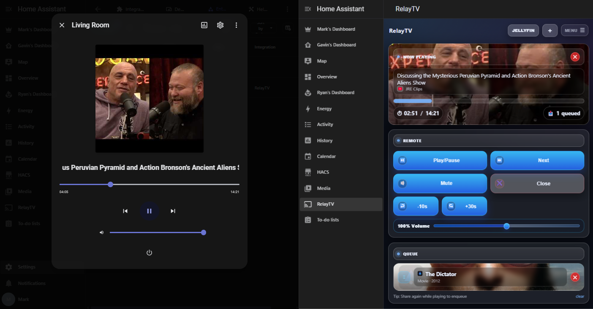

# RelayTV Home Assistant Integration



RelayTV for Home Assistant adds your self-hosted RelayTV servers as Home Assistant entities and services, making it easy to control playback, launch media, trigger overlays, and integrate RelayTV into automations and dashboards.

RelayTV server:  
https://github.com/mcgeezy/relaytv

Android companion app:  
https://github.com/mcgeezy/relaytv-android

Support the project:  
https://buymeacoffee.com/relaytv

---

## What This Integration Adds

RelayTV integrates with Home Assistant as a local `media_player` plus RelayTV-specific services.

### Core features

- Creates a `media_player` entity for each RelayTV config entry
- Supports multiple RelayTV servers
- Uses RelayTV live event updates plus `/status` refresh fallback
- Adds a Home Assistant sidebar panel for the RelayTV web UI
- Exposes RelayTV-specific services for smart play, temporary playback, overlays, snapshots, synchronized playback, upload/play, upload/enqueue, and resume behavior
- Supports automation-friendly control from scripts, dashboards, and mobile workflows

### Supported media controls

- Play
- Pause
- Stop
- Next
- Previous
- Seek
- Set volume
- Turn on
- Turn off

### Advanced RelayTV features

- Smart queue/play behavior
- Temporary interrupt + resume playback
- Text and image overlays
- Snapshot capture
- Multi-target synchronized playback
- Resume-position support
- Direct media upload from Home Assistant local media/files to RelayTV ingest endpoints
- Optional sensor-to-stream mapping triggers

---

## RelayTV Services

| Service | RelayTV endpoint | Notes |
| --- | --- | --- |
| `relaytv.smart_url` | `POST /smart` | Smart play/enqueue behavior |
| `relaytv.play_now` | `POST /play` | Immediate playback; clears queue |
| `relaytv.announce` | `POST /play` | Alias of `play_now` |
| `relaytv.play_temporary` | `POST /play_temporary` | Temporary interrupt + resume flow |
| `relaytv.overlay` | `POST /overlay` | Text/image overlay |
| `relaytv.play_synced` | `POST /play_at` | Multi-entity time-aligned start |
| `relaytv.snapshot` | `POST /snapshot` (fallback `GET /snapshot`) | Captures current frame |
| `relaytv.play_with_resume` | `POST /play` + `POST /seek_abs` | Resume per-URL saved position |
| `relaytv.upload_media` | `POST /ingest/media` | Upload local HA media/file and return RelayTV media URL |
| `relaytv.upload_media_play` | `POST /ingest/media/play` | Upload local HA media/file and start playback |
| `relaytv.upload_media_enqueue` | `POST /ingest/media/enqueue` | Upload local HA media/file and append to queue |

---

## Home Assistant Companion App Share Automation

Add this automation to share links to the Home Assistant Phone App and play them on TV

```yaml
alias: RelayTV - Smart play from share
description: Opens shared URLs/text in RelayTV via relaytv.smart_url
triggers:
  - event_type: mobile_app.share
    trigger: event
conditions:
  - condition: template
    value_template: "{{ shared | trim | length > 0 }}"
actions:
  - data:
      url: "{{ shared | trim }}"
    action: relaytv.smart_url
mode: single
variables:
  shared: |-
    {{ trigger.event.data.url
       if trigger.event.data.url is defined else
       (trigger.event.data.text if trigger.event.data.text is defined else '') }}
```

---

## Installation

### HACS

1. Open HACS in Home Assistant
2. Add this repository as a custom repository with category `Integration`
3. Install `RelayTV`
4. Restart Home Assistant
5. Add the `RelayTV` integration from **Settings → Devices & Services**

### Manual

1. Copy `custom_components/relaytv` into your Home Assistant config:

   ```text
   /config/custom_components/relaytv/
   ```

2. Restart Home Assistant
3. Go to **Settings → Devices & Services → Add Integration**
4. Search for **RelayTV**
5. Enter:
   - RelayTV base URL, for example `http://relaytv-host:8787`
   - Display name for this RelayTV instance

---

## Configuration Options

From the integration options flow, you can configure:

- `panel_enabled` — enable or disable sidebar panel registration
- `panel_target_entry_id` — choose which RelayTV server is used by the shared sidebar panel
- `sensor_stream_mappings` — map sensors to temporary playback URLs

---

## Example Service Calls

### Smart play / enqueue

```yaml
service: relaytv.smart_url
target:
  entity_id: media_player.relaytv_living_room
data:
  url: https://www.youtube.com/watch?v=dQw4w9WgXcQ
```

### Immediate playback

```yaml
service: relaytv.play_now
target:
  entity_id: media_player.relaytv_living_room
data:
  url: https://www.youtube.com/watch?v=dQw4w9WgXcQ
  use_ytdlp: true
  cec: false
```

### Temporary playback

```yaml
service: relaytv.play_temporary
target:
  entity_id: media_player.relaytv_living_room
data:
  url: https://example.com/doorbell-chime.mp3
  timeout: 10
  volume: 0.6
```

### Overlay message

```yaml
service: relaytv.overlay
target:
  entity_id: media_player.relaytv_living_room
data:
  text: Front door opened
  duration: 8
  position: top-right
```

### Upload media and play

```yaml
service: relaytv.upload_media_play
target:
  entity_id: media_player.relaytv_living_room
data:
  file_path: /config/www/clip.mp4
  title: Shared Clip
```

`file_path` must be readable by Home Assistant and allowed by `allowlist_external_dirs`.
When using the service UI, the `file` field can also select a local Home Assistant media source item.

---

## Typical Use Cases

- Send shared links from Home Assistant automations to a RelayTV screen
- Upload and play local Home Assistant media files on RelayTV
- Launch temporary doorbell or announcement media, then resume previous playback
- Display overlay messages on TVs around the home
- Add RelayTV as a dashboard-accessible media target
- Keep multiple RelayTV devices available in one Home Assistant setup
- Start synchronized playback across more than one RelayTV screen

---

## Known Limitations

- `relaytv.play_now` currently maps to RelayTV `POST /play` (queue-clearing behavior)
- RelayTV also exposes `POST /play_now`, but this integration does not currently use its preserve-current behavior
- No dedicated `clear_queue` Home Assistant service is currently registered by this integration
- Upload services require a local media source item or a file path available inside the Home Assistant container
- Overlay calls must include at least `text` or `image_url`
- Snapshots require active playback on the RelayTV server
- `/ui/events` is treated as a live push stream, not a replay log; `/status` remains the reconnect/bootstrap fallback

---

## Companion Projects

- RelayTV server: https://github.com/mcgeezy/relaytv
- RelayTV Android app: https://github.com/mcgeezy/relaytv-android

### Planned / work in progress

- iPhone companion app
- Continued multi-device and automation improvements
- Ongoing UX polish across the RelayTV ecosystem

---

## Support The Project

If RelayTV is useful to you, donations help support continued development of the server, Home Assistant integration, Android app, and future companion apps.

Buy me a coffee:  
https://buymeacoffee.com/relaytv

---

## Compatibility

Validated against the RelayTV server API and current app route structure.

## License

Same license as the RelayTV core project:  
https://github.com/mcgeezy/relaytv
